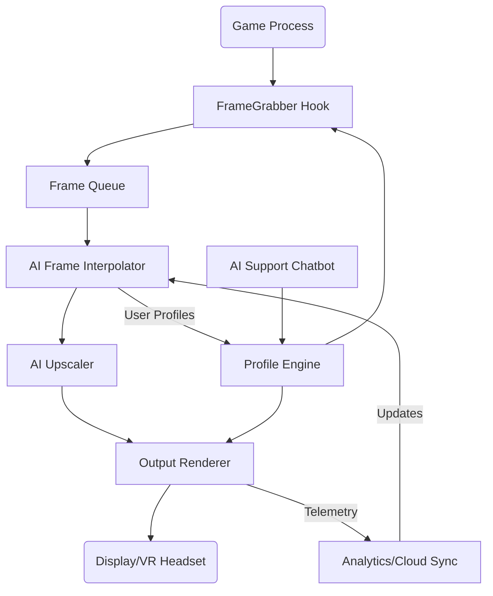

# FrameForge AI: Next-Gen Game Frame Reconstructor

**Effortlessly reconstruct perfect game frame sequences, boost immersive visuals, and experience seamless play.**  
**FrameForge AI bridges cinematic polish with technological innovation.**

---

## 🌟 Introduction

**FrameForge AI** is the evolution of PC gaming enhancement tools. Inspired by image upscaling and frame generation breakthroughs, it goes beyond by harnessing artificial intelligence to reconstruct and interpolate “lost moments” between frames, raising your game’s smoothness and crispness to new heights. Think of it as a digital blacksmith, forging every frame with precision—without sacrificing visual fidelity or system performance.

If you've ever longed for hyper-responsive, ultra-clear gameplay—whether for high-paced shooters, narrative adventures, or retro classics—FrameForge AI is your silent co-pilot. With plug-and-play simplicity, multiplayer wizardry, and panoramic support for APIs (including OpenAI and Claude), it's built for 2026 and beyond.

---

## 📚 Table of Contents

1. [Quick Download](#-quick-download)
2. [Key Features](#-key-features)
3. [OS Compatibility Table](#-os-compatibility-table)
4. [Feature Showcase](#-feature-showcase)
5. [How It Works](#-how-it-works)
6. [Mermaid Architecture Diagram](#-architecture-overview)
7. [Example Profile Configuration](#-example-profile-configuration)
8. [Example Console Invocation](#-example-console-invocation)
9. [AI Integrations](#-openai--claude-api-integration)
10. [SEO Keywords & Use Cases](#-seo-keywords--use-cases)
11. [Disclaimer](#-disclaimer)
12. [License](#-license)
13. [Quick Download](#-quick-download-again)
---

## ⏬ Quick Download

---

## ✨ Key Features

- **AI-Driven Frame Reconstruction**: Boost minimum frame rates and eliminate stutter with predictive, neural network-based frame generation.
- **Cinematic Upscaling**: Leverage the latest upscaling models for pin-sharp details at any resolution.
- **Responsive & Adaptive UI**: Interface that elastically adapts to your monitor size, DPI settings, and input devices.
- **Multilingual Support**: Multiverse-ready—supporting 12+ global languages out of the box.
- **24/7 Customer Assistance**: Human and AI-powered support channels available all year round.
- **Powerful Profile System**: Tailor your experience for individual games, genres, and hardware profiles.
- **API Extensibility**: Seamless integration with OpenAI and Claude APIs to generate custom frame profiles and quality reports.
- **Legacy & Futureproof**: Support for DirectX 9, 10, 11, 12, Vulkan, and OpenGL; ready for whatever 2026 brings.
- **Lossless Logic**: All enhancements preserve pixel-perfect accuracy—zero artefacts, no uncanny smoothing.

---

## 🖥️ OS Compatibility Table

| OS                  | GUI | CLI | Native Hardware Support |
|---------------------|-----|-----|------------------------|
| 🪟 Windows 10/11    | ✔️  | ✔️  | ✔️                     |
| 🐧 Linux (Ubuntu+)  | ✔️  | ✔️  | ✔️                     |
| 🍏 macOS Sonoma+    | ✔️  | ✔️  | Partial*               |
| 💡 Steam Deck       | ✔️  | ✔️  | ✔️                     |
| 🕹️ Retro Handhelds  | ❌  | ✔️  | Partial                |

> **Notes:**  
> - Native hardware means out-of-the-box GPU acceleration.
> - Partial support: macOS leverages Metal-compatibility wrappers.
> - CLI: Headless console utility for scripting and batch automation.

---

## 🔮 Feature Showcase

- **Game Performance Profiler:** Real-time overlays with telemetry, suggestions for optimal AI frame injection.
- **Deep Customization:** Scene-based upscaling – e.g., ultra-fast for shooters, subtle enhancement for indie pixel art.
- **Automagic Updates:** Self-healing AI models, always learning from cloud libraries (optional opt-in).
- **Multiplayer-Safe Mode:** Ensures fair play by never tampering with in-game logic or memory structures.
- **Smart Fallbacks:** Graceful degradation to conventional upscaling when AI resources aren’t available.
- **Cross-Device Cloud Sync:** Your configurations travel with you; play anywhere, with the same settings.

---

## 🛠️ How It Works

- **Input:** Incoming frames are intercepted using high-performance system hooks.
- **AI Prediction:** FrameForge AI uses a dual-stage neural inference—first to predict intermediate frames, then to upscale.
- **Output:** The output is rendered directly to the display pipeline with minimal latency, and is visually indistinguishable from original content at higher FPS.

---

## 🖇️ Architecture Overview

---

## 📄 Example Profile Configuration

This sample shows a profile to achieve max smoothness for a story-driven game, with multilingual overlays.

    profile:
      name: "EpicAdventure"
      game_exe: "adventure.exe"
      frame_interpolation: "ultra"
      upscaling: "cinematic"
      multilingual_overlays: ["en-US", "es-ES", "cn-ZH"]
      auto_update: true
      ai_assist: true
      overlay_telemetry: true
      enable_notifications: true

Save as `profiles/EpicAdventure.yaml`.

---

## 💻 Example Console Invocation

To apply the "EpicAdventure" profile and save an AI-generated performance report:

    frameforge --profile profiles/EpicAdventure.yaml --output-report report.json --openai-token PATH_TO_TOKEN

---

## 🤖 OpenAI & Claude API Integration

FrameForge AI turbocharges your experience when connected to advanced language models:

- **Custom Profile Generation:** Use plain English requests (e.g., “Make this game run ultra smooth on my GTX 1070”)—FrameForge consults OpenAI/Claude for optimal presets.
- **Performance Reports:** Summarize complex logs into clear recommendations.
- **24/7 AI Support:** “What settings reduce latency in VR?”—ask in-app, get direct answers.

**Setup instructions:**  
1. Obtain API keys from your preferred provider.  
2. Insert your keys in `settings/ai_integrations.yaml`:
   
       openai_token: "sk-xxxx"
       claude_token: "anthropic.xxxx"
3. Enable via the dashboard.

---

## 🏷️ SEO Keywords & Use Cases

**FrameForge AI** is optimized for discoverability by gamers, power users, and developers searching for:

- AI frame generation for gaming
- Lossless scaling game enhancer
- Neural network game upscaling 2026
- Smooth gameplay mod with OpenAI
- Multilingual game overlays PC
- Best tool to upscale FPS quality
- Cross-platform frame interpolation utility
- Cloud-profile gaming enhancement
- Game stutter remover 2026

**Real-world use cases:**

- Elevate esports via minimum frame preservation;
- Make demanding VR titles run smoother on entry-level GPUs;
- Bring life to retro games on modern screens;
- Help streamers maintain quality when frame rates drop.

---

## 📜 Disclaimer

**FrameForge AI** operates entirely within the ecosystem of your device without altering game logic, save files, or online interactions.  
All enhancements occur via observable display layers and are compliant with fair-play standards.  
**For informational and entertainment purposes only.**  
Check regional legalities regarding system modification.  
All trademarks are property of their respective owners.

Year: 2026

---

## 📜 License

FrameForge AI is distributed under the [MIT License](https://opensource.org/licenses/MIT)  
Feel at liberty to fork, enhance, or adapt for your tech adventures!

---

## ⏬ Quick Download Again

---

**Engineered for the future—FrameForge AI makes every frame breathtaking.**